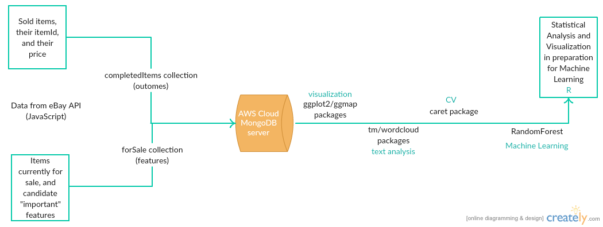
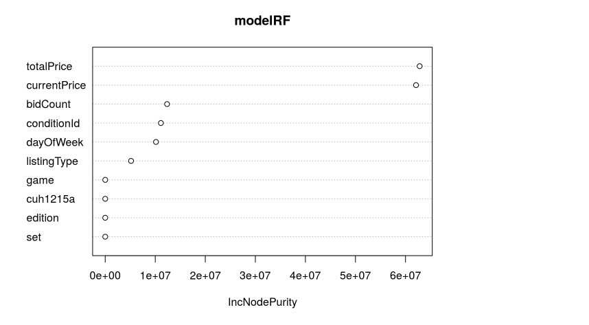

eBuy
========================================================
author: S. Jackson Kelley (A01281942)
date: November 16, 2016
autosize: true

Problem Description
========================================================
Given past sold Playstation 4s, can we predict the price of future Playstation 4s?

Tools/Methods
========================================================

Code Bases
========================================================
- ebay-api open source javascript library (for data retrieval, shown in previous presentation)
- Hmisc (for data imputation of NA's in R data frame)
- ggplot2/ggmap (for visualization of data set in R)
- tm/wordcloud (title analysis and visualization library)
- randomForest (for variable importance and as candidate ML algorithm)
- caret (for cross validation with ML algorithms and ML packages)

Progress
========================================================
Currently I've stored eBay data for roughly 2 weeks (between the last presentation and now) of Playstation 4s in an 
AWS server running the JavaScript code everyday and storing this data into a
mongoDB database.

In my previous presentation feature selection was flagged as a potential 
challenge with this project.  Therefore the mongoDB data has been pulled out 
of the AWS server and into R for statistical analysis and visualization in order
to make statistically informed decisions in regard to which features will be 
used in the various machine learning algorithms.

Progress
========================================================
Summary plots generated by R of the distribution of prices for the dataset.

Progress
========================================================
(histograms continued)

Progress
========================================================
Summary plots generated by R visualizing whether the day of the week is statistically significant to price sold.

Progress
========================================================
Summary plots generated by R visualizing whether "buy it 
now" is statistically significant to price sold.

Progress
========================================================
Summary plots generated by R visualizing whether there is correlation to the 
price items are sold for and the number of bids for various listing types.

Progress
========================================================
Is location statistically relevent to price sold?

Progress
========================================================
Is item title statistically relevent to price sold?

Progress
========================================================
Variable importance plot from Random Forest model.

Plans
========================================================
The data has been cleaned and analyzed, and predictors have been selected as important
by the Random Forest algorithm as well as various hypothesis tests (not shown in this presentation).  The next step will be training different
machine learning algorithms and reporting on their accuracy.  

After the semester ends I plan on implementing the selected machine learning algorithm on-line (I believe using Spark, but I have no experience with big data frameworks) to execute
predictions in real time.  I will then integrate this feature into the existing 
software and test whether the machine learned model is profitable in comparison
with the current model.

Expected Deliverables
========================================================
- A selected machine learning algorithm
- A measure of accuracy for the selected algorithm
- A list of candidate items for purchase from the dataset
- A predicted price associated with the items
- Expected profit from selected items

